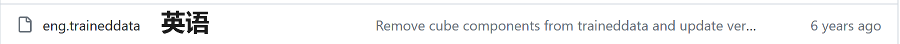

# [OCRmyPDF](https://ocrmypdf.readthedocs.io/en/latest/index.html)

## 安装

需要先安装chocolatey[chocolatey](https://docs.chocolatey.org/en-us/choco/setup/#more-install-options)

如果打不开，可以用以下命令先试试，同样摘自官网

> #### Install with PowerShell.exe
>
> With PowerShell, there is an additional step. You must ensure [Get-ExecutionPolicy](https://go.microsoft.com/fwlink/?LinkID=135170) is not Restricted. We suggest using `Bypass` to bypass the policy to get things installed or `AllSigned` for quite a bit more security.
>
> * Run `Get-ExecutionPolicy`. If it returns `Restricted`, then run `Set-ExecutionPolicy AllSigned` or `Set-ExecutionPolicy Bypass -Scope Process`.
> * Now run the following command:
>
> ```powershell
> Set-ExecutionPolicy Bypass -Scope Process -Force; [System.Net.ServicePointManager]::SecurityProtocol = [System.Net.ServicePointManager]::SecurityProtocol -bor 3072; iex ((New-Object System.Net.WebClient).DownloadString('https://community.chocolatey.org/install.ps1'))
> ```
>

主要技术含量可能在于要用管理员权限运行PowerShell

安装目录在C:\ProgramData\chocolatey


然后执行

```

choco install python3

choco install --pre tesseract

choco install pngquant

python3 -m pip install ocrmypdf

```

基本就算完成安装了

输入`mcrmypdf --help`检查安装情况

## 汉化-语言包安装

准确来说是安装[tesseract](https://github.com/tesseract-ocr/tessdata)的汉化，大概600M多，最好不要直接下，我试过，两个多小时还失败了

走fastgithub，`git clone git@githubfast.com:tesseract-ocr/tessdata.git`,不能说网速拉满，但是肯定比直接下快三倍

按需复制.traineddata文件，复制到C:\Program Files\Tesseract-OCR\tessdata里




千万不要把解压缩的tessdata替换原软件的tessdata，否则可能弹出找不到文件的错误，单纯把需要的翻译文件复制过去就行

## 使用

在pdf文件内打开cmd，尝试最简单的命令

```
ocrmypdf -l eng+chi_sim "中文待OCR.pdf" ocr.pdf #输出文件名可以自取
```

以上，'-l '是选项，'eng+chi_sim'是语言选择为英文+横板中文，其他进阶命令行查看官网文档可自行组合
