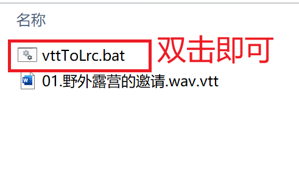
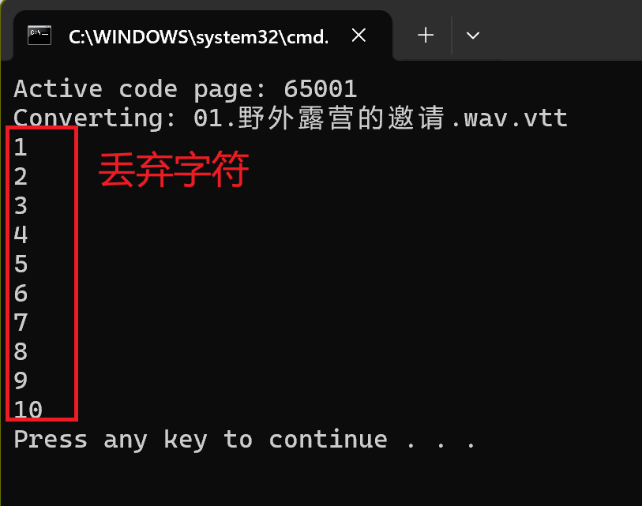
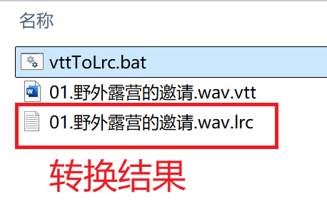
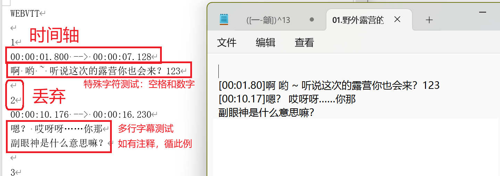

# [批处理文件-vttToLrc](vttToLrc/vttToLrc.bat)

在看有声书，官方字幕文件是vtt格式，但是AIMP好像只识别lrc文件，搜了一圈后自信开写：）

没学过batch文件语法，全靠AI，用的findstr所以很慢

文件在vttToLrc文件夹，拖拽到存储字幕文件的文件夹里双击运行即可

转换文件名务必不要包含不能处理的特殊字符，如空格等

以防出错，该程序不会删除源vtt文件，抛弃的字符串会在终端打印

## 附代码注释

```
@echo off
 ::设置中文编码格式：UTF-8
chcp 65001
setlocal EnableDelayedExpansion
::时间轴匹配格式，不用“-->”：因为是特殊字符
set b=":"
::计数器保护注释或多行语音不被丢弃
set counter=0
::数字匹配格式，丢弃
set c="^[0-9]*$"
::遍历当前目录的vtt文件
for %%f in (*.vtt) do (
    :: 打印当前处理文件
    echo Converting: %%f
    ::获得文件名
    set "base_name=%%~nf"
    ::去除后缀以便AIMP识别
    set "base_name=!base_name:.vtt=!"
    echo. > "!lrc_file!"
    ::遍历文本文件，"tokens=* delims="获得整行字符串以防一行内存在空格等
    for /f "tokens=* delims=" %%i in (%%f) do (
        ::匹配时间轴
        echo "%%i"| findstr %b% >nul && (
            ::时间轴和字幕不在一行，存储但不写入
            set ttt=%%i
            set counter=1
        )||(
            ::非时间轴，匹配数字内容确定是否丢弃，如无意外，字幕含数字也不会丢弃，除非字幕全是数字
            echo %%i| findstr /r %c% >nul &&(
                ::纯数字字符串，丢弃并在终端打印
                echo %%i
            )||(
                if !counter!==2 (
                    ::不和时间轴同行的文字
                    echo %%i>>"!lrc_file!"
                )
                f !counter!==1 (
                    ::和时间轴同行的文字，设置计数器以保护多行字幕
                    echo [!ttt:~3,8!]%%i>>"!lrc_file!"
                    set counter=2
                )
            )
        )
    )
)
setlocal DisableDelayedExpansion
:end
::结束程序
pause
```

# 使用



## 终端输出



## 测试转换结果




## 新增文件：txtToLrc

功效和使用与上同
