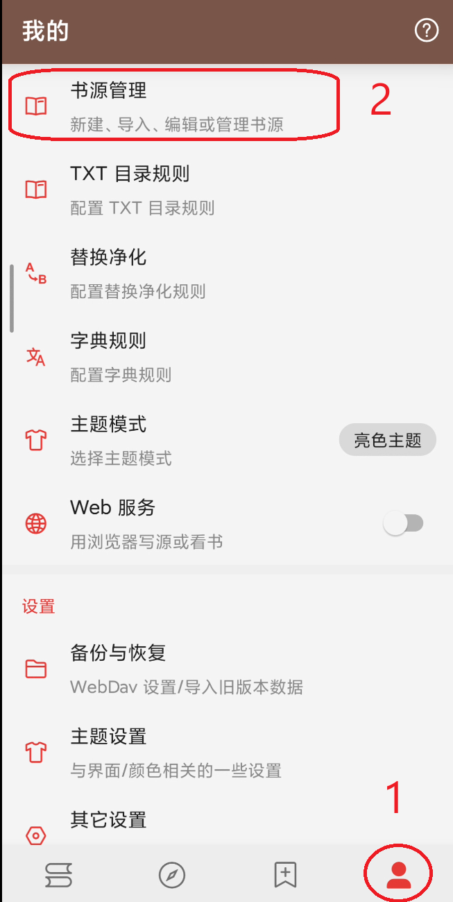
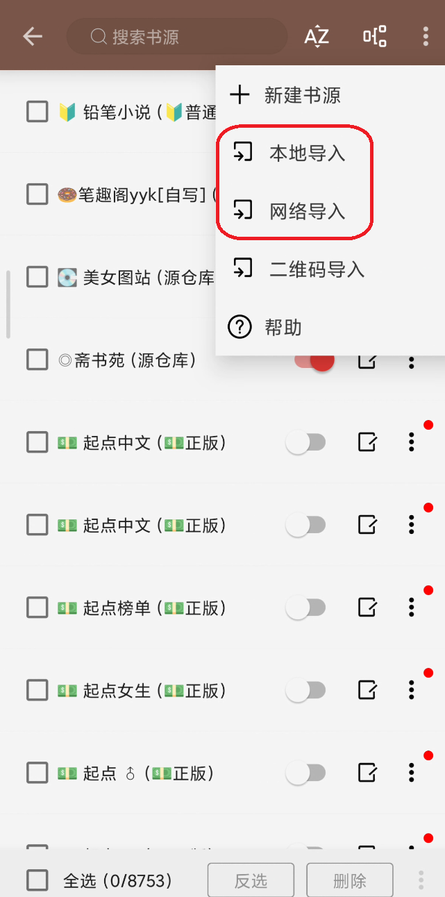
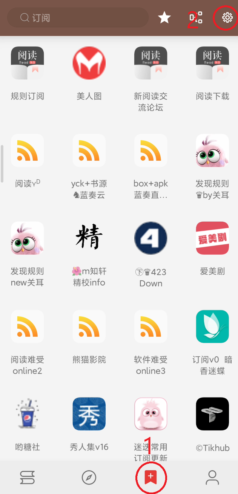
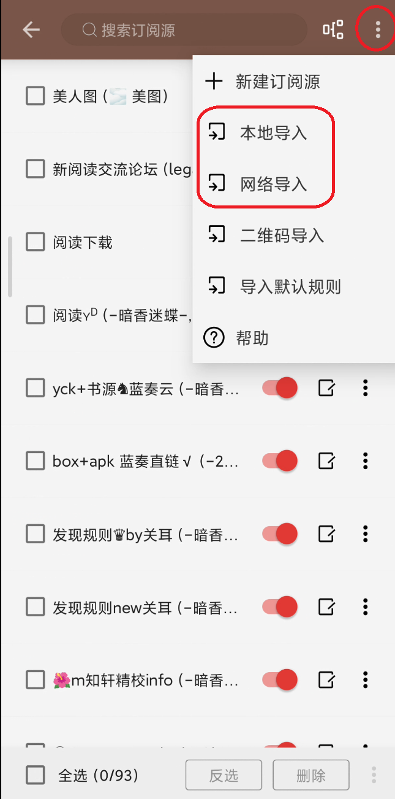

# [开源阅读-legado](https://github.com/gedoor/legado)

希望看到的技术小白少被收费盗版资源骗

但是笔者也是小白，所以随便写写

## 安装

apk文件，没有什么安装上的技术难度，就是使用太折磨了，所以再写一篇记录一下

主要介绍书源导入，本地书导入很简单，[官方文档](https://gedoor.github.io/docs/get-started-quickly/add-book)按需查看

## 导入

分本地导入和网络导入，本地导入只是把网络链接的文件下在本地然后导入，本质是一样的

本地导入的文件格式为json，也可以是txt。json导入失败就把后缀改成.txt再试试

网络导入地址一般为:`https://域名/**.json`，也有可能是.txt结尾，原理如上所言

要区分订阅源和书源两个概念，不能混淆导入，会报错

### 书源配置的位置

## 订阅源配置的位置

## 书源仓库推荐

[**Yiove 综合书源库**](https://shuyuan.yiove.com/complex)：非常全，非常多

[**源仓库**](https://www.yckceo.com/yuedu/shuyuan)：非常多，但部分需要魔法

## 各种不常见链接格式导入

### legado://import/rssSource?src=https://

订阅源的意思，点击即可跳转软件导入，也可以复制src后面的网址到订阅源进行网络导入

### yuedu://booksource/importonline?src=https

书源的意思，点击即可跳转软件导入，也可以复制src后面的网址到书源进行网络导入
